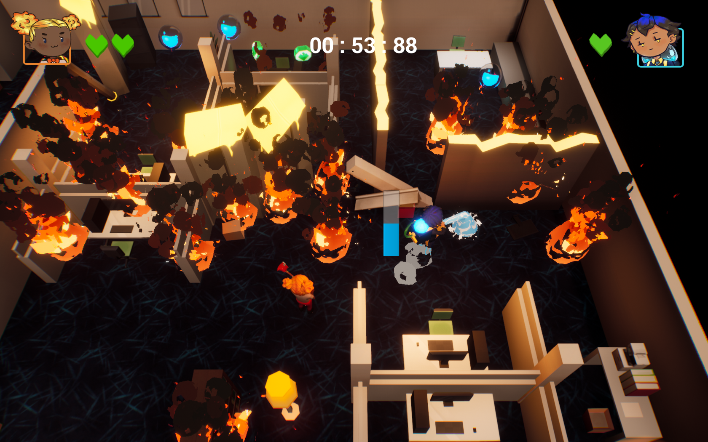
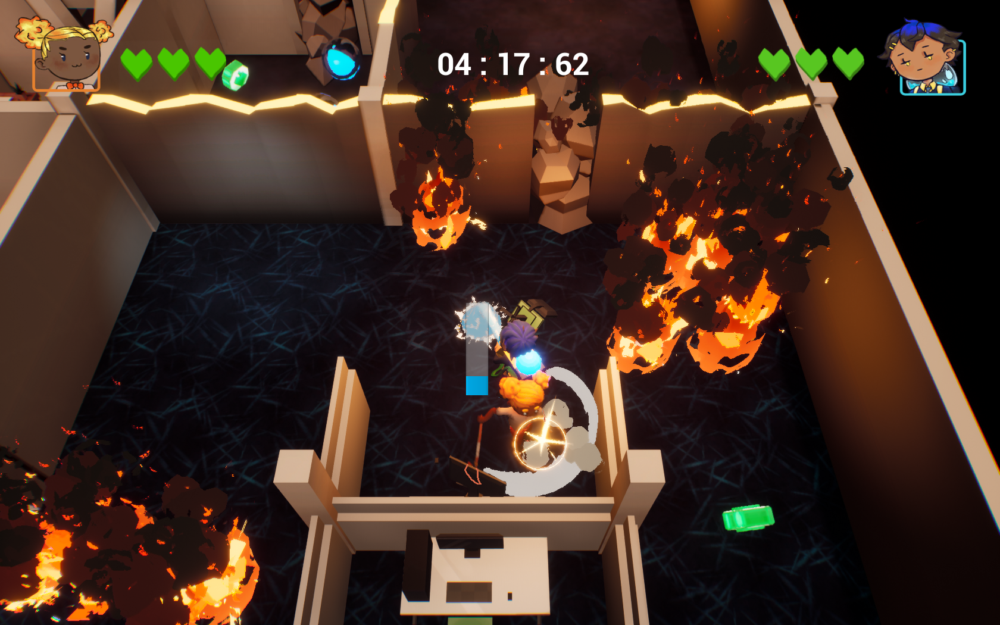

<body>

<h2>Firefight!</h2>

Firefight is an action puzzle, local co-op game, that has you play as two office workers escaping a burning office building by working together. 
Firefight is the first game that I have developed in Unreal Engine 4. Prior to that, I had no experience in using the Unreal 4 Engine. It took approximately 5 months to create Firefight. 

The other developers of Firefight are:  
<ul>
<li>Hannah Holden - Character Artist  
<a href = "https://www.linkedin.com/in/hannahholden015/" title="Linkedin Profile">LinkedIn Profile</a>   </li>
<li>Tassia Jaric - Environment Artist  
<a href = "https://www.linkedin.com/in/tassiajaric/" title="Linkedin Profile">LinkedIn Profile</a>   </li>
<li>John Kim - VFX Artist  
<a href = "https://www.linkedin.com/in/johnkim92/" title="Linkedin Profile">LinkedIn Profile</a>   </li>
<li>Shane Dalton - Designer  
<a href = "https://www.linkedin.com/in/shanedaltondesign/" title="Linkedin Profile">LinkedIn Profile</a>   </li>
</ul>

<h4>Screenshots for Firefight!</h4>

<h4>Gameplay for Firefight!</h4>


<a href="https://stevencoombe.github.io/Portfolio/" title="Home">Home</a>

</body>