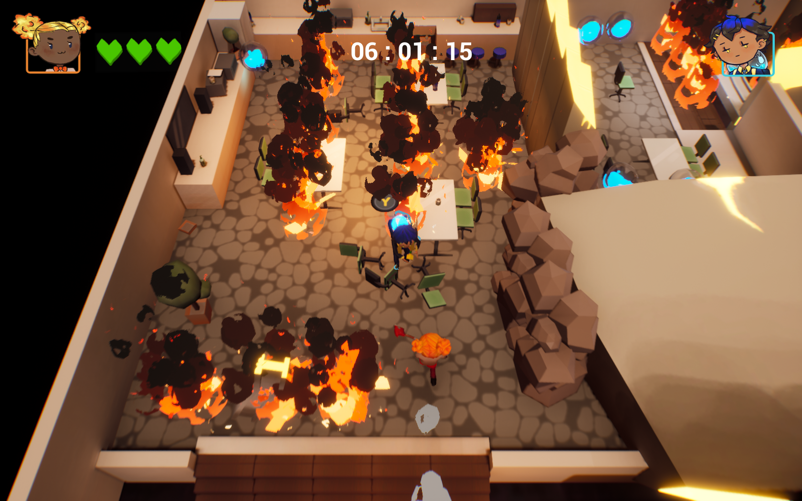

<h2>Firefight!</h2>

Firefight is an action puzzle, local co-op game, that has you play as two office workers escaping a burning office building by working together. 
 
Firefight is the first game that I have developed in Unreal Engine 4. The team that developed Firefight consisted of 3 artists, a designer and programmer(me).

<h4>Firefight Screenshots!</h4>

